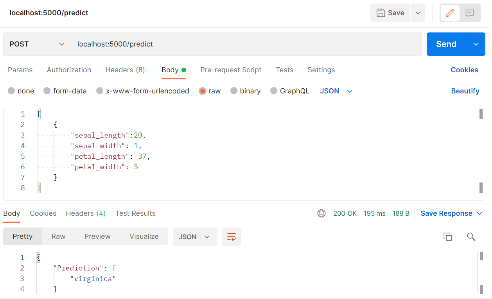

# DockerFlaskPostgres

In this project we set up a  basic Rest API service using Flask, PostgreSQL and Docker.
I hope it can be useful for anyone starting to work with docker.

## Docker, Python and Postman

Install docker: https://docs.docker.com/engine/install/

Install python: https://www.python.org/downloads/

Install postman:https://www.postman.com/downloads/
## Flask 

Check that flask image is working, build the image with the following command:

`docker build -t name_of_the_image .`

Don't run the container, it will throw an error message because it depends on a database that is not up and running.

## Postgres

Check postgres image is working.

In this case, we can run the container of the database because it doesn't deppend on the application.

Before running the container create the folder where we will store the data collected by flask.
In your project directory run the following command:

`mkdir postgresdata`

Now we can run the postgres container to see that it works. Use the following command:

`docker run -v ./postgresdata:/var/lib/postgresql/data -p 5432:5432 -e POSTGRES_PASSWORD=1234 -d postgres`

Once we checked everything works independently we can remove the image of flask and the container of postgres.

To see created images: 

`docker images`

We can only remove images that are not in use. If we want to remove an image that is in use, first we will have to remove the container that is using the image. After doing that the image can be removed.
To remove image:

`docker image rm [IMAGE..]`

To see running container:

`docker ps`

To remove container:

`docker rm [CONTAINER..]`


## docker-compose

Now that we checked that everything works independently we only have to run the docker-compose.yml file.
The docker-compose file is usefull to run containers that need a lot of variables to be specified. It also allows us to run containers in an organized way.

To set up this service run the docker-compose file we simply have to type this command:
`docker-compose up`

Or we can run the sh file by running the command:

`bash run.sh`

If everything started correctly we should see that we have two containers running: the flask app and the postgres database.
To check that our service is working as we desire, we are going to send a POST request using Postman.
This POST request should return a prediction and this prediction should be stored in our postgres database.

Your Postman should look like this:


The input JSON is the following:
```
[
    {
        "sepal_length":20,
        "sepal_width": 1,
        "petal_length": 37,
        "petal_width": 5
    }
]
```

When we recive a no error answer from postman, it is time to check that our database is storing the values correctly.
To do so we are going to check the table where we are storing the data inside of our container.

To get "inside" our postgres container run the following command:

`docker exec -it [CONTAINER_ID] bash`

To enter the postgres console run the following commands:

`su postgres`

`psql`

Now  with the following command we connect to the database named postgres where we have our table

`\c postgres`

To list the tables inside our database use the command:

`\dt`

We should see a table named "registros".
To check the values of the table:

`SELECT * FROM registros;`

If we can see predicted values, our service has been set up correctly.

I hope this was useful!


